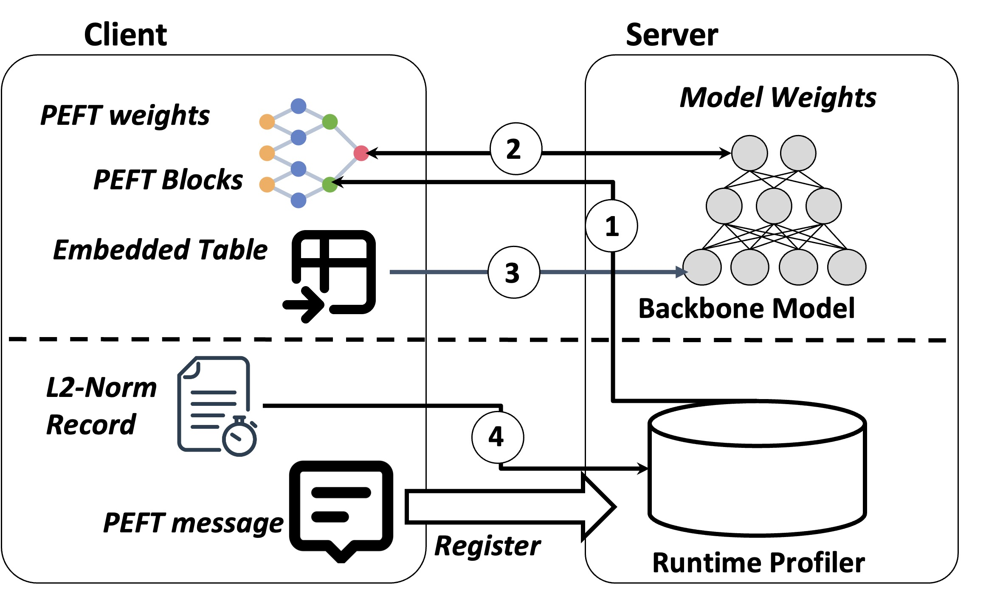

# DLoRA-EMNLP24 Findings(to be appeared)
The code will consist of two parts:
1. Host-side scripts
2. Device-side scripts -- (under construction)
# Overall Assumptions
We are assuming the LoRA modules are stored on the device side while the backbone model is on the host side, as in the following architecture depicts.
# Install Dependency

# Bash Scripts

# Acknowledge
This repo benefits from [PEFT](https://huggingface.co/docs/peft/en/index), [LLM_adapters](https://github.com/AGI-Edgerunners/LLM-Adapters), [Alpaca-lora](https://github.com/tloen/alpaca-lora). Thanks for their wonderful works, it really saves me tons of time :)
